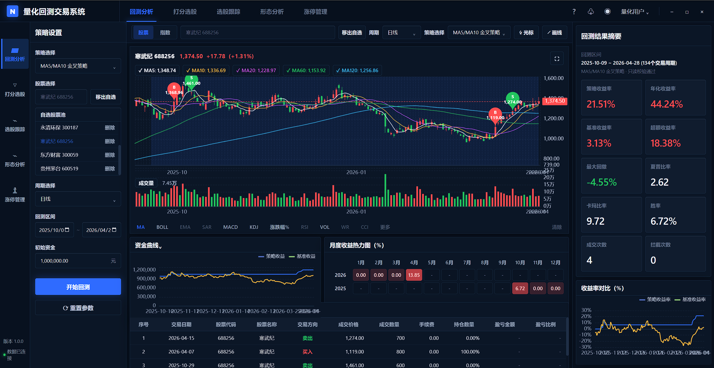
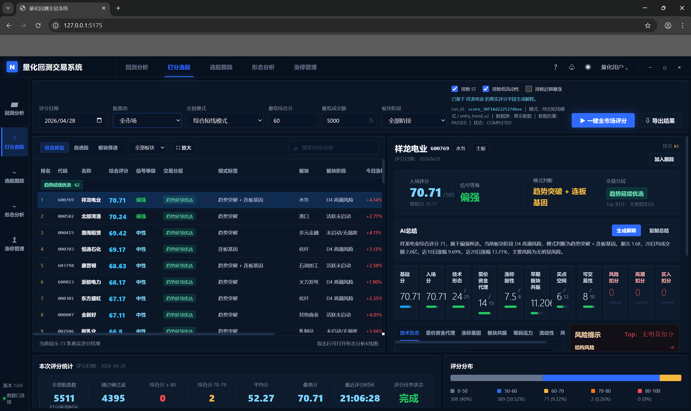
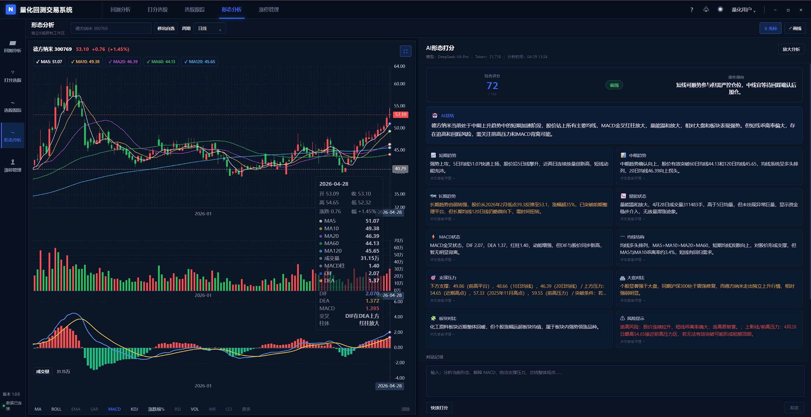
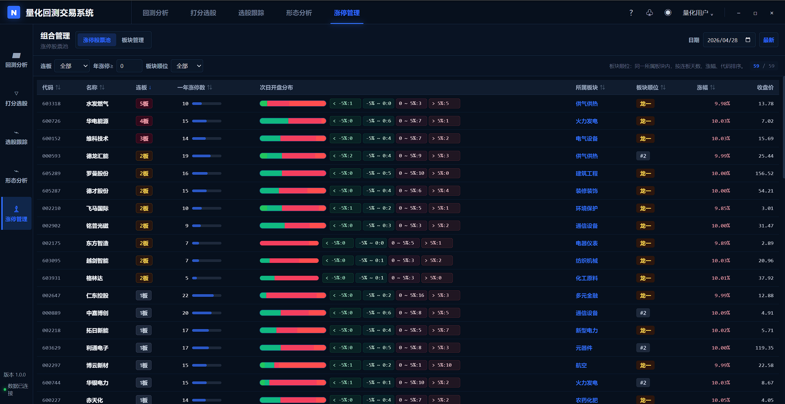

# A股日频量化研究与选股系统 MVP

我使用 Claude Code、Codex 与 Hermes Agent 协作，构建了一个 A 股日频量化研究与选股系统 MVP。项目解决的核心痛点是：个人量化研究中数据接入、清洗、因子构建、回测验证、选股跟踪和结果展示往往割裂，容易出现数据污染、未来函数、结果不可解释、回测与真实交易约束脱节等问题。本项目将这些环节整合为一个本地可运行、可审计、可扩展的量化研究终端。

## 系统架构

系统后端基于 Python，前端基于 React + TypeScript。数据层通过 Provider 抽象同时支持 Mock 数据和真实 Tushare 数据，形成 raw、bronze、silver、feature_store 等分层数据湖，并使用 Parquet、DuckDB、SQLite 分别管理市场数据、分析数据和业务数据。

核心流程是：数据同步与校验 → 标准化入库 → 构建研究面板 → 收盘后全市场筛选 → 输出候选股票、风险提示和因子解释 → 进入回测、跟踪和前端可视化。系统覆盖日线行情、日频指标、资金流向、涨跌停、停牌、复权因子、财务、指数和行业数据，支持全市场级别研究。

## 功能特性

功能上，系统已实现收盘后选股、策略回测、K 线与技术指标展示、板块分析、选股跟踪、盈亏统计、CSV 导出和本地自选管理。选股结果不仅给出排名，还能展示候选逻辑、风险来源、可交易性约束和次日买入参考，目标是筛出"次日仍有买入性价比"的趋势延续标的，而不是只做静态排名。

## AI Agent 协作链路

AI Agent 协作链路包含长链推理和多 Agent 分工：

- 我负责定义交易目标、数据边界和验收标准
- Claude Code 负责阅读真实代码、生成和重构模块、补齐测试、运行审计并输出报告
- Codex 负责代码级实现建议、复杂逻辑改造和工程方案迭代
- Hermes Agent 负责飞书连接、远程指令发送、任务触发和结果接收，使我可以通过飞书远程调度本地量化流程并获取执行反馈

每次迭代都经过需求拆解、Agent 执行、测试验证、构建检查和审计复盘。目前项目已包含约 90 个 Python 源码文件、约 16 个 React/TypeScript 组件、100+ 条测试用例，形成了从数据到研究、从回测到前端交互、从本地执行到远程指令闭环的 AI 驱动开发成果。

## 系统截图

<table>
  <tr>
    <td align="center"> 系统主界面</td>
    <td align="center"> 选股结果</td>
  </tr>
  <tr>
    <td align="center"> 策略回测</td>
    <td align="center"> 数据面板</td>
  </tr>
</table>

## 演示视频

- [在线观看](https://raw.githubusercontent.com/liucan51/a-share-quant-research/refs/heads/master/demo_no_audio.mp4)
- [下载视频](https://github.com/liucan51/a-share-quant-research/releases/download/demo-v1/demo_no_audio.mp4)
